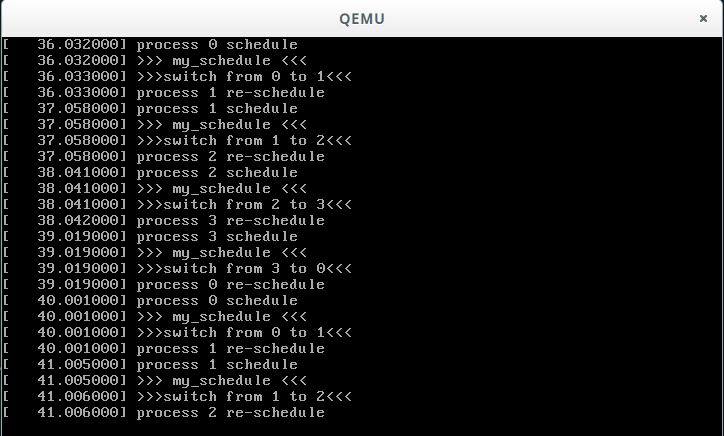

#	Welcome to the KINK(KernelInKernel)
-------

<font color=0x00ffff>
It is a platform to write your own OS kernel,its based on Linux Kernel 3.9.4/4.1.0 source code
</font>


##1.1	install qemu
-------


your can use `qemu` to run our kernel(KINK).

install qemu by

```c
sudo apt-get install qemu # install QEMU
```


```
sudo ln -s /usr/bin/qemu-system-i386 /usr/bin/qemu
```

or
```
sudo ln -s /usr/bin/qemu-system-x86_64 /usr/bin/qemu
```

##1.2	make KInK
-------


build **linux-3.9.4**

```c
cd linux-3.9.4
make
```

build **linux-4.1**

```c
cd linux-4.1
make
```

##1.3	run KInK
-------

run KInK in linux-3.9.4

```c
cd linux-3.9.4
make run
```

run KInK in **linux-4.1**

```c
cd linux-4.1
make run
```


#2	How to Make
-------

##2.1	make内核
-------

mykernel-3.9.4是linux-3.9.4的构建目录

mykernel-4.1.0是linux-4.1.0的构建目录

他们都采用了同样的构建方式
<font color=0x00ffff>
1.	首先将3.x和4.x内核的源代码, 下载到download目录下

2.	接着想内核源代码解压缩到kernel, 并拷贝处两个副本linux-x.x.x.new和linux-x.x.x.src, 前者作为我们自己的kernel构建，　后者则是一份纯净的linux内核源码, 两个副本有利于我们生成自己的patch

3.	patch内核, 使linux内核开机后执行我们自己定义的start_kernel

4.	使用预先的.config(位于configs目录的下mini-86.config文件)配着linux内核的编译参数, 也可以使用make allnoconfig使用默认配置, 至此.config文件生成,　可以执行make构建内核的操作

5.	make构建内核, 为了保持内核源码的纯净, 我们使用make O=.out将内核构建到.out目录下, 构建完成后将在构建目录.out的arch/x86/boot下生成内核镜像bzImage

6.	qemu -kernel bzImage用qemu启动内核
</font>


我们的makefile设置了所有自动化的配置工作, 可以直接使用make来完成所有的工作,但是我们仍然有必要了解构建的过程,　这对于我们学习, 修改以及出错排查都有帮助

构建**linux-3.9.4**

```c
cd linux-3.9.4
make
```

构建**linux-4.1**

```c
cd linux-4.1
make
```


如果您想了解详细的构建机理, 请参照如下信息

#2.2	根目录
-------

| 目录 | 描述 |
|:-------:|:-------:|
| mykernel-3.9.4 | linux-3.9.4的构建目录 |
| mykernel-4.1.0 | linux-4.1.0的构建目录 |
| kink-src		 | 不断开发和改进的KINK小巧内核, 开发完成后, 将导入到内核构建目录的src中参与构建 |
| mykernel.sh | 早期的构建脚本, 已经废弃, 现在已经使用makefile来完成自动化构建, 但是脚本myel.sh仍可以给我们基本的构建思路 |
| doc | 操作系统的文档信息 |
| doc/os2013 | [2013年暑期补课计算机操作系统原理](https://github.com/mengning/mykernel/wiki/OS2013) |
| README.md | 帮助文档 |

##2.3	构建目录结构
-------

mykernel-3.9.4是linux-3.9.4的构建目录

mykernel-4.1.0是linux-4.1.0的构建目录


首先来看下mykernel-x.x的目录结构

| 目录 | 描述 |
|:-------:|:-------:|
| downloads | 内核源代码的下载目录 |
| kernel | 内核源代码将被解压到kernel目录 |
| patches | 我们自己kernel的补丁 |
| configs |  内核源代码的.config文件, 但是我们编译linux-3.9.4内核的时候并未使用, 而是在集结make allnoconfig |
| src | 我们内核的基本框架, 它并没有patch到内核中, 内核源代码树中的mysrc目录直接链接到了源码src中 |
| Makefile | 用于构建的Makefile |
| README.md | 文档信息 |

#2.4	makefile构建过程
-------


在构建的过程中会产生几个构建隐藏目录.stamps和.out

其中.stamps为我们的构建完成准备工作

| .stamps子目录 | 描述 |
|:-------:|:-------:|
| downloads | 用于make完成linux内核源码的下载, 内核源码下载完成后, 此文件时间戳将被更新(create/touch) |
| extract | 内核源代码下载完成后, 由extract完成内核源代码的解压缩, 将解压缩两个副本(linux-x.x.src和linux-x.x.new), 其中src是最原始的源码, 用于生成新的patch时候使用, new是我们的工作源码目录, 其中包含了一个指向了kernel源码src的链接文件mysrc |
| patch | extract完成了解压缩之后, 交由patch来完成内核补丁的添加, 完成后更新patch的时间戳(以供makefile完成依赖检查) |
| config | 最后config完成了内核.config的配置 |


#2.5	总结
-------

<font color=0x00ffff>
**不用makefile如何一步一步构建内核**
</font>

makefile的执行过程其实相当于执行了如下命令

以内核linux-4.1为例, 其中与linux-3.9内核有差别的地方我们会单独列出


**首先安装qemu**
```c
sudo apt-get install qemu # install QEMU
```

```
sudo ln -s /usr/bin/qemu-system-i386 /usr/bin/qemu
```

或者
```
sudo ln -s /usr/bin/qemu-system-x86_64 /usr/bin/qemu
```

**下载内核源码** download Linux Kernel 4.1 source code, 源代码被下载到downloads目录下

```c
cd downloads
wget https://www.kernel.org/pub/linux/kernel/v4.x/linux-4.1.tar.xz
```

**解压缩内核源码**, 会将内核源代码解压缩到kernel目录下
```

cd download
xz -d linux-4.1.tar.xz
tar -Jxvf linux-4.1.tar -C ../kernel #被解压缩kernel/linux-4.1目录下
```

**配置内核源代码目录**, 配置出linux-4.1.new和linux-4.1.src两个目录

```c
cd ../kernel
cp linux-4.1 linux-4.1.src
mv linux.4.1 linux-4.1.new
```

**patch内核**, 用我们的start_kernel替代linux原本的start_kernel, 以完成我们自己的内核平台

```c
cd linux-4.1-new
patch -p1 < ../../patches/linux-4_1-mykernel.patch
```

**link我们的src目录**, 我们需要构建的是内核源码树linux-4.1.new目录, 而我们的内核kernel在src中, 因此将src连接到内核源码的mysrc, 这样我们在src中直接修改代码, 直接make即可 

```c
cd linux-4.1-new
ln -s ../../src mysrc
```
其中连接link和删除链接rmlink的工作可以直接交给make link/rmlink来完成, 具体请见makefile


**构建内核在目录.out中完成**, 需要构建的是内核源码树linux-4.1.new目录

我们为了保证内核源码树的清洁, 构建不再源码树中完成, 而是在.out隐藏目录完成此工作, 因此我们先创建此目录
```c
cd ../..
mkdir -p .out
```

**配置内核的BUILD构建配置文件.config**


linux-4.1需要拷贝.config
```c
cp configs/mini-x86.config .out/config
```
如果是linux-3.9.4, 我们不使用配置好的.config而是使用默认配置, 则执行如下操作

```c
make allnoconfig
```

**构建内核**, 使用O=$(pwd)/../../.out将构建任务指定到.out目录下

```c
cd kernel/linux-4.1.0.new
make O=$(pwd)/../../.out
```

**运行操作系统**, 可以使用make run直接运行, 其本质上是执行了如下命令

```c
qemu -kernel .out/arch/x86/boot/bzImage 
```

从qemu窗口中您可以看到my_start_kernel在执行，同时my_timer_handler时钟中断处理程序周期性执行。


#3	运行KINK操作系统
------

**运行操作系统**, 可以使用

```c
make run
```

直接运行, 其本质上是执行了如下命令

```c
qemu -kernel .out/arch/x86/boot/bzImage 
```


linux3.9.4的运行情况


linux4.1.0的运行情况




#4	如何生成/添加patch
-------


首先我们先删除mysrc的工作目录, 当然你也可以选择不删除, 这样的话我们自己kernel的源码也会集成到patch中, 而多数情况下, 我们希望生成的是一个纯净的patch, 一个可以被被人拿来直接穿件自己kernel的patch.


使用diff对比两个new和src两个构建目录的异同, 即可生成一个patch

```c
diff -Naur linux-4.1.src linux-4.1.new/ >linux-4.1-mykernel.patch
```
也可以直接使用make genpatch直接生成patch

将patch添加到内核中可以直接使用

```c
patch -p1 < ../../patches/linux-4_1-mykernel.patch
```

也可以使用make patch直接添加patch


#5	改进自己的KINK内核
-------

我们在根目录的kink-src目录中不断完善自己的内核, 然后将内核拷贝到mykernel-x.x.x的src文件中, 执行make操作即可参与构建

##5.1	为什么使用3.9.4和4.1.0两个内核

其实完全可以使用一个内核, 但是, 基于一下几点, 我们保留了对个内核.

*	我们的项目是在[jserv/kernel-in-kernel](https://github.com/jserv/kernel-in-kernel)(基于linux-4.1.0)和[mengning/mykernel](https://github.com/mengning/mykernel)(基于linux-3.9.4)的基础上整合在一起的, 而后者也是在前者的基础上改进的, 这些都是原作者的劳动成果, 我们应该给予尊重
.
*	该项目的本质是希望通过一个模拟的内核机制来实现我们自定义的进程调度机制或者其他内核机制, 因此在多个版本的内核中同时编译运行, 不同的内核中采用不同的机制或者不同的参数, 利于我们开发改进


*	我们的KINK在不断的完善, 给出两个或者多个分支版本, 即可以方便我们对比进度和完善的情况, 也利于我们分析其在不同内核中的运行情况.

*	由于linux内核在不断更新, 我们不排除后期仍然会增加其他的内核版本, 甚至可能添加一些早期版本比如2.x


##5.2	如何编写自己的内核
-------

你可以直接在mykernel-x.x.x的src目录中直接修改KINK内核代码, 由于该目录被链接到了build目录kernel/linux-x.x.x.new/mysrc中, 因为我们该文件的修改将在build过程中直接更新的内核linux内核和KINK中

但是我们也提供了根的kink-src目录来开发, 这个目录可以做为KINK-src的存档目录.

即进行KINK开发, 你可以

*	在mykernel-x.x.x的src目录修改, 并直接编译, 一些重要的版本可以备份到kink-src目录

OR

*	将kink-src作为工作目录, 在完成后, 将源码拷贝到对应内核版本的mykernel-x.x.x的src目录中, 然后执行make build操作

OR

*	我们说过了linux-kernel内核源代码的mysrc是一个指向了src的链接目录, 如果你觉得每次拷贝麻烦, 你甚至可以直接将mysrc连接到kink-src目录, 这样就不同每次拷贝了.

<font color=0x00ffff>
kink-src中源码, 以及mysrc, src的源码结构如下
</font>

| 文件 | 描述 |
|:-------:|:-------:|
| pcb.h | 进程的基本信息PCB结构 |
| interrupt.c | 周期性中断处理, 其功能类似与周期性调度器 |
| scheduler.c | 主调度器, 如果需要更改调度机制, 主要是更改此目录 |
| main.c | KINK-kernel的主函数 |
| Makefile | 构建内核源码需要的makefile |


#6	Comments
-------

* KernelInKernel一个短小精悍的模拟内核，在Linux内核的基础山已补丁patch的方式实现, 通过屏蔽掉linux内核的启动函数,　实现自己的start_kernel来启动一个小巧的操作系统

*	本系统在[jserv/kernel-in-kernel](https://github.com/jserv/kernel-in-kernel)(基于linux-4.1.0)和[mengning/mykernel](https://github.com/mengning/mykernel)(基于linux-3.9.4)的基础上实现, 将两者整合在一起, 借鉴了前者的makefile机制和后者的调度器.


#7	Links
-------
*	[Linux进程管理与调度-之-目录导航](http://blog.csdn.net/gatieme/article/details/51456569)

*	[Linux内核分析期末总结](http://blog.csdn.net/pianogirl123/article/details/51287024)


* [2013年暑期补课计算机操作系统原理](https://github.com/mengning/mykernel/wiki/OS2013)

